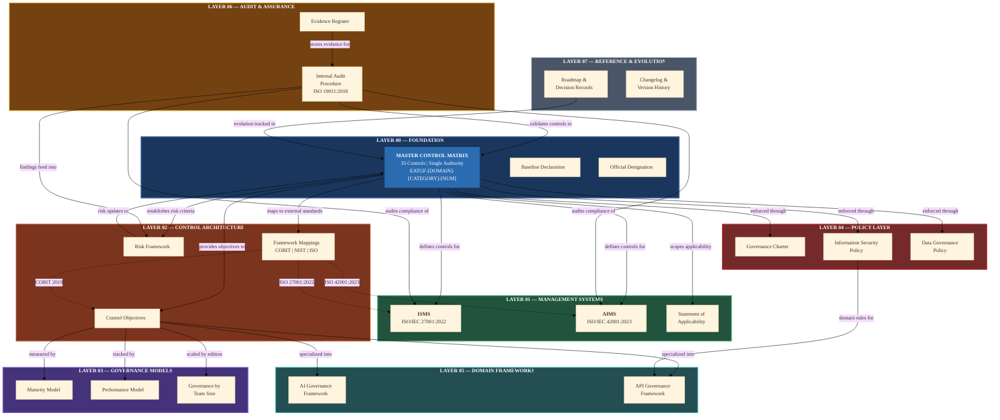

# EATGF Architecture Model & Structural Diagram

**Enterprise AI-Aligned Technical Governance Framework (EATGF)**

**Version:** 1.1
**Layer:** 00_FOUNDATION
**Status:** Structured Refactor

---

## Purpose

This document defines the formal architectural structure of the Enterprise AI-Aligned Technical Governance Framework (EATGF).

It provides:

- Layered governance model
- Structural separation of concerns
- Control authority positioning
- Relationship between Enterprise Backbone and Developer Layer
- Diagrammatic representation of framework hierarchy

The architecture ensures that governance logic, operational controls, and developer guidance remain structurally aligned and non-duplicative.

---

## Architectural Position

**EATGF Layer:** 00_FOUNDATION

**Scope:** Meta-Architecture Definition

**Authority Relationship:** Defines structural topology of all EATGF layers

This document governs how the framework is organized, not how individual controls operate.

---

## Governance Principles

- Single Control Authority (MCM is exclusive source of controls)
- Layered Separation (Foundation ≠ Management ≠ Developer Guidance)
- Non-Duplication of Controls
- Explicit Mapping to International Standards
- Scalability Across Organization Sizes
- Audit Traceability by Design

**The architecture prevents structural drift and duplication.**

---

## Technical Implementation

### 1. EATGF Layer Taxonomy

```
00_FOUNDATION
01_MANAGEMENT_SYSTEMS
02_CONTROL_ARCHITECTURE
03_GOVERNANCE_MODELS
04_POLICY_LAYER
05_DOMAIN_FRAMEWORKS
06_AUDIT_AND_ASSURANCE
07_REFERENCE_AND_EVOLUTION
08_DEVELOPER_LAYER (Planned Integration)
```

### 2. Structural Hierarchy Diagram

```
                        ┌───────────────────────────┐
                        │        00_FOUNDATION       │
                        │  Identity / Version / MCM  │
                        └──────────────┬────────────┘
                                       │
        ┌──────────────────────────────┼──────────────────────────────┐
        │                              │                              │
┌──────────────┐              ┌──────────────┐              ┌──────────────┐
│01_MANAGEMENT │              │02_CONTROL    │              │03_GOVERNANCE │
│SYSTEMS       │              │ARCHITECTURE  │              │MODELS        │
│(ISMS/AIMS)   │              │(Mappings)    │              │(Maturity)    │
└──────────────┘              └──────────────┘              └──────────────┘
        │                              │                              │
        └──────────────┬───────────────┴──────────────┬───────────────┘
                       │                              │
              ┌──────────────┐               ┌──────────────┐
              │04_POLICY     │               │05_DOMAIN     │
              │LAYER         │               │FRAMEWORKS    │
              └──────────────┘               └──────────────┘
                       │                              │
                       └──────────────┬───────────────┘
                                      │
                              ┌──────────────┐
                              │06_AUDIT      │
                              │ASSURANCE     │
                              └──────────────┘
                                      │
                              ┌──────────────┐
                              │08_DEVELOPER  │
                              │LAYER         │
                              └──────────────┘
```

### 3. Control Authority Model

- **MASTER_CONTROL_MATRIX (MCM)** is the sole control definition source.
- All layers reference MCM.
- No layer defines new standalone controls without MCM update.
- Developer Layer implements, not redefines.

### 4. Enterprise Backbone vs Developer Layer

| Component           | Role                                        |
| ------------------- | ------------------------------------------- |
| Enterprise Backbone | Governance, compliance, audit defensibility |
| Developer Layer     | Secure implementation guidance              |
| MCM                 | Control authority                           |
| Management Systems  | ISO-aligned governance                      |
| Developer Modules   | Implementation playbooks                    |

**The two coexist without conflict.**

### 5. Mermaid Diagram Source



---

## Control Mapping

| Architectural Aspect            | ISO 27001:2022 | NIST SSDF | OWASP               | COBIT |
| ------------------------------- | -------------- | --------- | ------------------- | ----- |
| Governance Structure            | A.5.1          | PO.1      | SAMM Governance     | EDM02 |
| Change Governance               | A.8.32         | PW.3      | SAMM Implementation | BAI06 |
| Secure Development Architecture | A.8.28         | PW.7      | ASVS V1             | BAI03 |
| Audit Architecture              | A.5.35         | RV.1      | —                   | MEA03 |

Architecture model ensures structural compliance alignment.

---

## Developer Checklist

Before adding new content:

- [ ] Identify correct EATGF layer
- [ ] Confirm no duplication of controls
- [ ] Map to MCM control ID
- [ ] Include ISO/NIST/OWASP/COBIT mapping
- [ ] Confirm architectural consistency
- [ ] Validate placement within taxonomy

**No document may exist outside defined layers.**

---

## Governance Implications

Without architectural discipline:

- Control duplication occurs
- Standards mapping fragments
- Audit scope becomes unclear
- Developer guidance conflicts with governance backbone
- Public portal loses structural credibility

**Architecture governance preserves institutional authority.**

---

## Official References

- ISO/IEC 27001:2022 – A.5.1 Policies
- ISO/IEC 27001:2022 – A.8.28 Secure Development
- NIST SP 800-218 (SSDF) – PO.1, PW.7
- COBIT 2019 – EDM02, BAI03
- OWASP SAMM – Governance & Architecture

---

**Document Version:** 1.1
**Change Type:** Structured Refactor
**Baseline Compatibility:** EATGF-v1.0-Foundation Compatible
