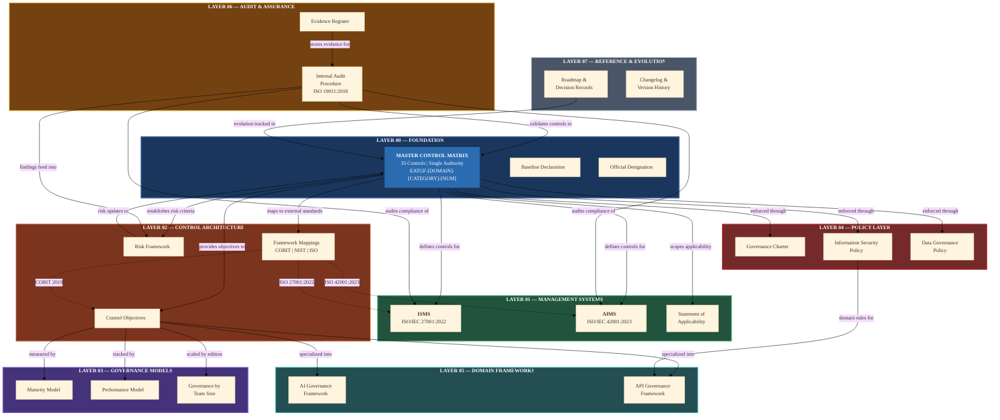

# EATGF Architecture Diagram

## Enterprise AI-Aligned Technical Governance Framework (EATGF)

| Field | Value |
|-------|-------|
| Document Type | Framework |
| Version | 1.0 |
| Classification | Public |
| Effective Date | 2026-02-14 |
| Authority | Enterprise Architecture & Governance Office |
| MCM Reference | EATGF-GOV-ARC-001 |

---

## 1. Purpose

This document establishes the official architecture diagram specification for the Enterprise AI-Aligned Technical Governance Framework (EATGF). The diagram defines the structural relationships, data flows, and control traceability across all 8 governance layers.

## 2. Scope

This specification covers:

- The visual representation of all 8 EATGF layers and their interdependencies
- The Master Control Matrix (MCM) as the single control authority
- Governance data flow direction (top-down enforcement, bottom-up assurance)
- Control traceability from MCM through implementation to audit evidence
- Lateral mapping to external standards (ISO, COBIT, NIST)

## 3. Definitions

| Term | Definition |
|------|-----------|
| Control Authority | The MCM — the single source of truth for all 35 EATGF controls from which all other layers derive their mandate |
| Governance Data Flow | The directional movement of control definitions, policy enforcement, and assurance feedback through the framework layers |
| Control Traceability | The ability to trace any control from its MCM definition through policy, implementation, evidence, and audit assessment |

## 4. Responsibilities

| Role | Responsibility |
|------|---------------|
| Enterprise Architect | Maintains the architecture diagram and validates structural accuracy after framework changes |
| Governance Office | Approves changes to the architecture that affect layer boundaries or control flow |
| Document Author | References this diagram when creating cross-layer documentation |

---

## 5. Architecture Diagram — Mermaid Source



---

## 6. Diagram Legend

| Element | Visual Treatment | Meaning |
|---------|-----------------|---------|
| **MCM node** | Thick border (4px), distinct blue fill | Single control authority — all flows originate here |
| **Solid arrows** (`-->`) | Directed edges with labels | Governance data flow — defines the enforcement/implementation relationship |
| **Dashed arrows** (`.->`) | Dotted directed edges | External standard mappings — lateral reference relationships |
| **Layer subgraphs** | Color-coded backgrounds | Each governance layer has a distinct color for visual identification |
| **Arrow labels** | Text on edges | Describes the nature of the relationship between nodes |

### Layer Color Assignments

| Layer | Color | Hex | Rationale |
|-------|-------|-----|-----------|
| 00 Foundation | Navy | `#1a365d` | Authority and permanence |
| 01 Management Systems | Forest Green | `#22543d` | Operational maturity |
| 02 Control Architecture | Burnt Orange | `#7b341e` | Structural precision |
| 03 Governance Models | Deep Purple | `#44337a` | Strategy and measurement |
| 04 Policy Layer | Dark Red | `#742a2a` | Enforcement and compliance |
| 05 Domain Frameworks | Teal | `#234e52` | Specialized technical governance |
| 06 Audit & Assurance | Gold | `#744210` | Assessment and validation |
| 07 Reference & Evolution | Slate Gray | `#4a5568` | Historical and archival |

---

## 7. Governance Data Flow Explanation

### 7.1 Top-Down Enforcement Flow

The primary governance data flow moves from the Foundation layer downward through the framework:

1. **MCM defines controls** — The Master Control Matrix establishes all 35 controls with unique identifiers, objectives, owners, and evidence requirements.
2. **Management Systems implement** — ISMS and AIMS operationalize the controls within their respective ISO management system structures. The Statement of Applicability maps each control to implementation status.
3. **Control Architecture structures** — Control Objectives provide the measurable targets. The Risk Framework assigns risk scores. Framework Mappings trace each control to external standards.
4. **Governance Models measure** — The Maturity Model assesses organizational readiness. The Performance Model tracks KPI achievement. Governance by Team Size defines edition-specific applicability.
5. **Policy Layer enforces** — The Governance Charter mandates organizational compliance. Domain-specific policies (Information Security, Data Governance) translate controls into enforceable rules.
6. **Domain Frameworks specialize** — AI and API Governance Frameworks inherit from the control architecture and policy layer to provide domain-specific implementation guidance.
7. **Audit validates** — The Internal Audit Procedure assesses compliance of ISMS, AIMS, and MCM controls. The Evidence Register stores audit artifacts.

### 7.2 Bottom-Up Assurance Flow

Assurance flows upward from audit through the framework:

1. **Audit findings** — The Internal Audit Procedure generates findings classified by severity (Major Nonconformity, Minor Nonconformity, Observation, Opportunity for Improvement).
2. **Risk updates** — Findings that indicate control failures update the Risk Framework with revised risk scores and treatment plans.
3. **MCM corrections** — Significant findings may trigger control modifications in the MCM, which then cascade downward through all dependent layers.
4. **Evolution tracking** — All changes are recorded in the Reference & Evolution layer (Layer 07) for historical traceability.

### 7.3 Lateral Mapping Flow

External standard mappings operate laterally across the framework:

- **ISO/IEC 27001:2022** clauses map to ISMS controls and corresponding MCM control IDs
- **ISO/IEC 42001:2023** clauses map to AIMS controls and corresponding MCM control IDs
- **COBIT 2019** processes map to Control Objectives across all 5 domains (EDM, APO, BAI, DSS, MEA)
- **NIST CSF** functions map to security-domain controls within the MCM
- **OWASP** categories map to API Governance Framework security controls

---

## 8. Control Traceability

### 8.1 Traceability Direction

Every MCM control shall be traceable through the following chain:

```
MCM Control Definition
  → Management System Clause (ISMS or AIMS)
    → Control Objective (measurable target)
      → Policy Enforcement Rule (organizational mandate)
        → Domain Framework Implementation (technical specification)
          → Evidence Artifact (audit proof)
            → Audit Assessment (compliance finding)
```

### 8.2 Traceability Example

| Chain Link | Reference | Content |
|-----------|-----------|---------|
| MCM Control | EATGF-SEC-ACC-001 | Access Control — Role-based access to governance artifacts |
| ISMS Clause | Clause 9.2 (Annex A.9) | Access control policy and user access management |
| Control Objective | Ensure role-based access is enforced across all governance systems |
| Policy Rule | Information Security Policy, Section 3 — Access Control Requirements |
| Domain Implementation | API Governance Framework — Authentication and authorization standards |
| Evidence | Access control matrix, user provisioning logs, access review records |
| Audit Finding | Internal Audit Procedure — Assessment against Annex A.9 controls |

---

## 9. PNG Export Guidance

### 9.1 Mermaid CLI Export

```bash
# Install Mermaid CLI
npm install -g @mermaid-js/mermaid-cli

# Export to PNG (light mode)
mmdc -i EATGF_ARCHITECTURE_DIAGRAM.mmd -o EATGF_Architecture_Light.png \
  -w 2400 -H 3200 -b white

# Export to PNG (dark mode)
mmdc -i EATGF_ARCHITECTURE_DIAGRAM.mmd -o EATGF_Architecture_Dark.png \
  -w 2400 -H 3200 -b "#1a202c"

# Export to SVG (scalable, preferred for portal embedding)
mmdc -i EATGF_ARCHITECTURE_DIAGRAM.mmd -o EATGF_Architecture.svg \
  -w 2400 -H 3200
```

### 9.2 Export Specifications

| Parameter | Value |
|-----------|-------|
| Minimum width | 2400px |
| Minimum height | 3200px |
| Resolution | 300 DPI minimum for print |
| Background (light) | `#ffffff` |
| Background (dark) | `#1a202c` |
| Format (web) | SVG (preferred) or PNG |
| Format (print) | PDF or PNG at 300+ DPI |

### 9.3 Embedding in Portal

Place exported images in `governance-docs-site/portal/static/img/` and reference in Markdown:

```markdown

```

For the Docusaurus portal, prefer embedding the Mermaid source directly in the document (Docusaurus supports Mermaid via `@docusaurus/theme-mermaid`). Add to `portal/docusaurus.config.ts`:

```typescript
markdown: {
  mermaid: true,
},
themes: ['@docusaurus/theme-mermaid'],
```

---

## 10. Governance Enforcement Rules

1. The architecture diagram defined in this document is the authoritative representation of the EATGF structure. No alternative architecture diagrams shall be published without approval from the Enterprise Architecture & Governance Office.
2. Any modification to framework layer boundaries, control flows, or traceability chains requires an update to this diagram prior to implementation.
3. The MCM shall remain the single control authority in all representations. No diagram may depict an alternative control registry.
4. All exported images shall be version-labeled (e.g., `EATGF_Architecture_v1.0_Light.png`).

---

**Document Control**

| Version | Date | Author | Change Description |
|---------|------|--------|-------------------|
| 1.0 | 2026-02-14 | Enterprise Architecture & Governance Office | Initial architecture diagram specification |

**Authority Sign-Off**

| Role | Name | Date | Signature |
|------|------|------|-----------|
| Enterprise Architect | | | |
| Chief Governance Officer | | | |
