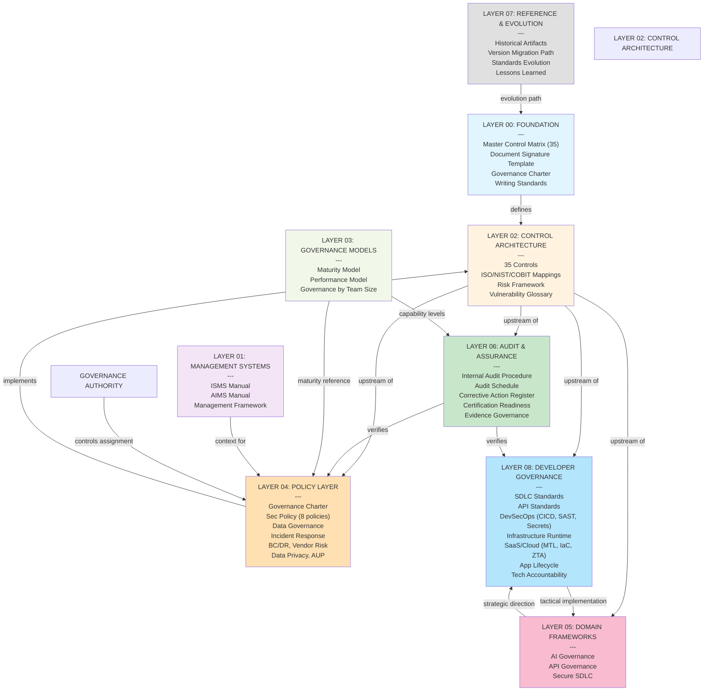
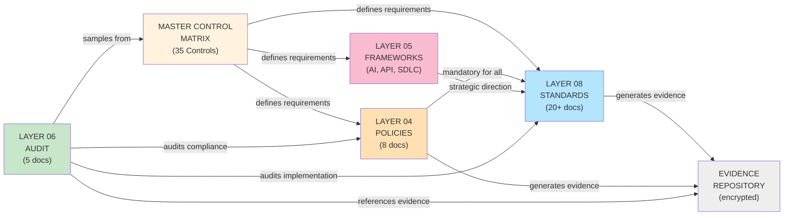
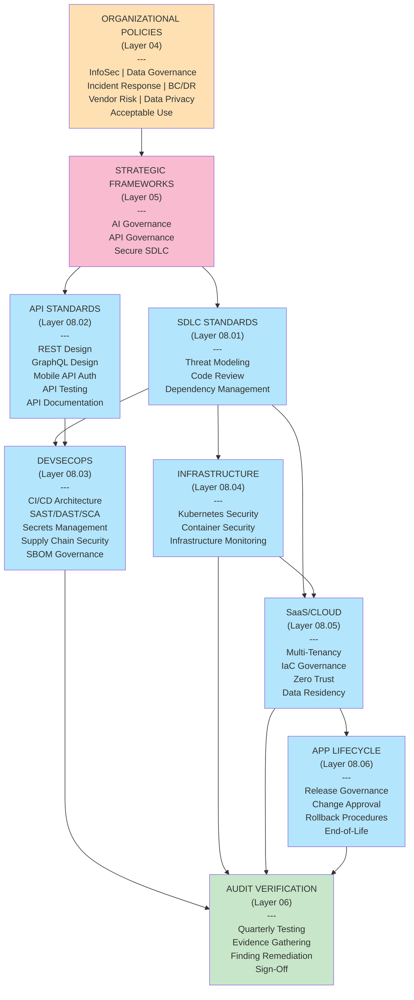
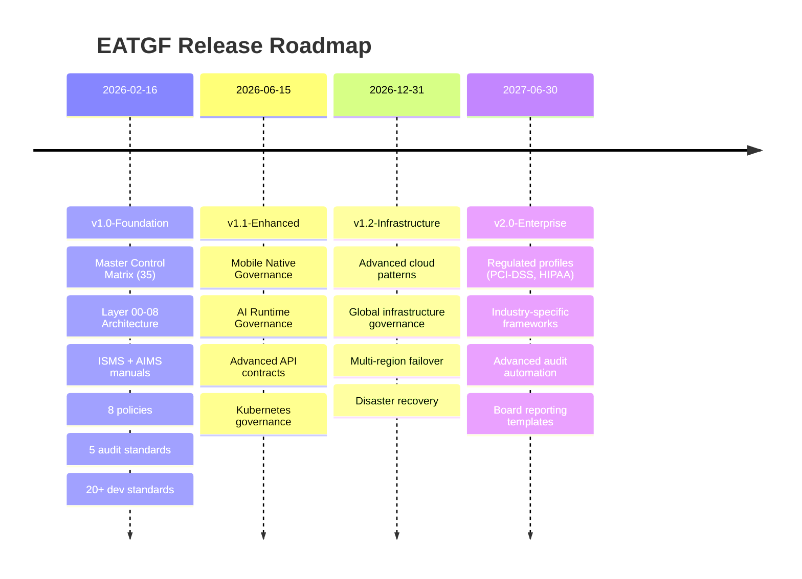

# EATGF v1.0-Foundation: Architecture Diagram

## Layer Architecture



## Document Relationships & Evidence Flow



## Developer's View: Standards Stack



## Audit & Control Verification Path

```mermaid
graph LR
    SELECTION["AUDITOR SELECTS<br/>EATGF-APO-RISK-01:<br/>Vendor Risk<br/>Management"]
    
    POINTER_L02["LAYER 02<br/>Control Definition<br/>---<br/>'Vendor risk must<br/>be continuously<br/>managed'"]
    
    POINTER_L04["LAYER 04<br/>Policy Document<br/>---<br/>06_VENDOR_AND_<br/>THIRD_PARTY_RISK_<br/>MANAGEMENT_POLICY"]
    
    POINTER_L08["LAYER 08<br/>Implementation<br/>---<br/>Vendor security<br/>review checklist<br/>in procurement"]
    
    EVIDENCE["EVIDENCE<br/>COLLECTION<br/>---<br/>Vendor assessment<br/>questionnaires<br/>Audit reports<br/>Signed contracts"]
    
    FINDING["AUDIT FINDING<br/>---<br/>'2 of 15 vendors<br/>missing SOC 2<br/>certification'"]
    
    REMEDIATION["REMEDIATION<br/>PLAN<br/>---<br/>Timeline:<br/>60 days<br/>Owner: Procurement"]
    
    CLOSE["FINDING<br/>CLOSED<br/>---<br/>All vendors<br/>certified;<br/>re-test passed"]
    
    SELECTION --> POINTER_L02
    POINTER_L02 --> POINTER_L04
    POINTER_L04 --> POINTER_L08
    POINTER_L08 --> EVIDENCE
    EVIDENCE --> FINDING
    FINDING --> REMEDIATION
    REMEDIATION --> CLOSE
    
    style SELECTION fill:#fff3e0
    style POINTER_L02 fill:#fff3e0
    style POINTER_L04 fill:#ffe0b2
    style POINTER_L08 fill:#b3e5fc
    style EVIDENCE fill:#eeeeee
    style FINDING fill:#ffccbc
    style REMEDIATION fill:#ffccbc
    style CLOSE fill:#c8e6c9
```



## Knowledge Discovery: How to Navigate EATGF

```text
 YOU ARE HERE: Adopting EATGF

 GOAL: Implement vendor risk management

 NAVIGATION PATH:

1. START: Read HOW_TO_ADOPT_EATGF.md
   └─ Tells you: "Stage 2: Implement Policies"
   
2. POLICIES: Go to LAYER 04_POLICY_LAYER/
   └─ Read: 06_VENDOR_AND_THIRD_PARTY_RISK_MANAGEMENT_POLICY.md
   └─ Action: Customize policy for your organization
   
3. CONTEXT: Want to know WHY?
   └─ Go to: LAYER 02_CONTROL_ARCHITECTURE/MASTER_CONTROL_MATRIX.md
   └─ Find: EATGF-APO-RISK-01 (Vendor Risk Management)
   └─ See: ISO 27001 A.8.34-35 requirement
   
4. STRATEGIC FRAMEWORK: Want to understand WHAT vendors do?
   └─ Go to: LAYER 05_DOMAIN_FRAMEWORKS/...
   └─ (If APIs): API Governance > vendor API management
   └─ (If Data): Data Governance > vendor data handling
   
5. IMPLEMENTATION: How do we DO this?
   └─ Go to: LAYER 08_DEVELOPER_GOVERNANCE_LAYER/
   └─ If vendor provides APIs: API_GOVERNANCE_STANDARD.md
   └─ If vendor supplies software: SBOM_GOVERNANCE_STANDARD.md
   └─ If vendor has access: SECRETS_MANAGEMENT_STANDARD.md
   
6. AUDITING: How do we VERIFY it's working?
   └─ Go to: LAYER 06_AUDIT_AND_ASSURANCE/
   └─ Read: PROOF points in CERTIFICATION_READINESS_CHECKLIST_STANDARD.md
   └─ Template: EVIDENCE_GOVERNANCE_STANDARD.md
   
 COMPLETE: You have end-to-end governance path for vendor risk
```

## Version History & Release Path



---

## Key Relationships Summary

| Layer | Purpose | Upstream | Downstream | Audit Frequency |
|-------|---------|----------|-----------|-----------------|
| **00** | Foundation | None | All | Annual |
| **01** | Management System Context | 00 | 02-08 | Annual |
| **02** | 35 Control Definitions | 00-01 | 04-08 | Annual |
| **03** | Maturity Models | 00-02 | Staffing | Annual |
| **04** | Organizational Policies | 02 | 06, 08 | Annual |
| **05** | Strategic Frameworks | 02-03 | 08 | Annual |
| **06** | Audit Standards | 02, 04, 08 | None (measures) | Quarterly |
| **07** | Evolution & History | All | Future versions | As-needed |
| **08** | Implementation Standards | 04-05 | 06 (evidence) | Quarterly |

---

## Quick Reference: Document Locations

```
eatgf-framework/
├── 00_FOUNDATION/
│   ├── MASTER_CONTROL_MATRIX.md ⭐ (start here)
│   ├── EATGF_DOCUMENT_SIGNATURE_TEMPLATE.md
│   └── GOVERNANCE_CHARTER.md
│
├── 02_CONTROL_ARCHITECTURE/
│   ├── MASTER_CONTROL_MATRIX.md (35 controls)
│   └── FRAMEWORK_MAPPINGS.md (ISO/NIST/COBIT)
│
├── 04_POLICY_LAYER/
│   ├── GOVERNANCE_CHARTER.md
│   ├── INFORMATION_SECURITY_POLICY.md
│   ├── DATA_GOVERNANCE_POLICY.md
│   ├── INCIDENT_RESPONSE_POLICY.md
│   ├── BC_DR_POLICY.md
│   ├── VENDOR_RISK_POLICY.md
│   ├── DATA_PRIVACY_POLICY.md
│   └── ACCEPTABLE_USE_POLICY.md
│
├── 06_AUDIT_AND_ASSURANCE/
│   ├── AUDIT_SCHEDULE_STANDARD.md
│   ├── CORRECTIVE_ACTION_REGISTER_STANDARD.md
│   ├── CERTIFICATION_READINESS_CHECKLIST.md
│   └── EVIDENCE_GOVERNANCE_STANDARD.md
│
├── 08_DEVELOPER_GOVERNANCE_LAYER/
│   ├── 01_SECURE_SDLC/
│   ├── 02_API_GOVERNANCE/
│   ├── 03_DEVSECOPS_GOVERNANCE/
│   │   ├── CI_CD_SECURITY_ARCHITECTURE.md
│   │   ├── SAST_DAST_SCA_POLICY.md
│   │   ├── SECRETS_MANAGEMENT_STANDARD.md
│   │   ├── SUPPLY_CHAIN_SECURITY_STANDARD.md
│   │   └── SBOM_GOVERNANCE_STANDARD.md
│   ├── 04_INFRASTRUCTURE_RUNTIME/
│   ├── 05_SAAS_AND_CLOUD_GOVERNANCE/
│   │   ├── MULTI_TENANCY_GOVERNANCE_STANDARD.md
│   │   ├── INFRASTRUCTURE_AS_CODE_GOVERNANCE.md
│   │   └── ZERO_TRUST_ARCHITECTURE_STANDARD.md
│   ├── 06_APPLICATION_LIFECYCLE_GOVERNANCE/
│   ├── 07_TECHNICAL_ACCOUNTABILITY_MODEL/
│   └── SLSA_FRAMEWORK_STANDARD.md
│
├── CHANGELOG.md (v1.0-Foundation)
├── HOW_TO_ADOPT_EATGF.md (adoption guide)
└── API_GOVERNANCE_AUTHORITY_CLARIFICATION.md
```

---

**Last Updated:** February 16, 2026  
**EATGF v1.0-Foundation Architecture & Navigation Guide**
