# EATGF v1.0-Foundation: Architecture Diagram

## Layer Architecture

```mermaid
graph TD
    A["🏗️ LAYER 00: FOUNDATION<br/>---<br/>Master Control Matrix (35)<br/>Document Signature Template<br/>Governance Charter<br/>Writing Standards"]
    
    B["📋 LAYER 01: MANAGEMENT SYSTEMS<br/>---<br/>ISMS Manual<br/>AIMS Manual<br/>Management Framework"]
    
    C["🎯 LAYER 02: CONTROL ARCHITECTURE<br/>---<br/>35 Controls<br/>ISO/NIST/COBIT Mappings<br/>Risk Framework<br/>Vulnerability Glossary"]
    
    D["📊 LAYER 03: GOVERNANCE MODELS<br/>---<br/>Maturity Model<br/>Performance Model<br/>Governance by Team Size"]
    
    E["📜 LAYER 04: POLICY LAYER<br/>---<br/>Governance Charter<br/>Sec Policy (8 policies)<br/>Data Governance<br/>Incident Response<br/>BC/DR, Vendor Risk<br/>Data Privacy, AUP"]
    
    F["🔧 LAYER 05: DOMAIN FRAMEWORKS<br/>---<br/>AI Governance<br/>API Governance<br/>Secure SDLC"]
    
    G["✅ LAYER 06: AUDIT & ASSURANCE<br/>---<br/>Internal Audit Procedure<br/>Audit Schedule<br/>Corrective Action Register<br/>Certification Readiness<br/>Evidence Governance"]
    
    H["🧠 LAYER 07: REFERENCE & EVOLUTION<br/>---<br/>Historical Artifacts<br/>Version Migration Path<br/>Standards Evolution<br/>Lessons Learned"]
    
    I["⚙️ LAYER 08: DEVELOPER GOVERNANCE<br/>---<br/>SDLC Standards<br/>API Standards<br/>DevSecOps (CICD, SAST, Secrets)<br/>Infrastructure Runtime<br/>SaaS/Cloud (MTL, IaC, ZTA)<br/>App Lifecycle<br/>Tech Accountability"]
    
    J["📊 LAYER 02: CONTROL ARCHITECTURE"]
    
    K["🎨 GOVERNANCE AUTHORITY"]
    
    A -->|defines| C
    C -->|upstream of| E
    C -->|upstream of| G
    C -->|upstream of| F
    C -->|upstream of| I
    
    E -->|implements| C
    G -->|verifies| E
    G -->|verifies| I
    
    F -->|strategic direction| I
    I -->|tactical implementation| F
    
    D -->|maturity reference| E
    D -->|capability levels| G
    
    B -->|context for| E
    
    H -->|evolution path| A
    
    K -->|controls assignment| E
    
    style A fill:#e1f5ff
    style B fill:#f3e5f5
    style C fill:#fff3e0
    style D fill:#f1f8e9
    style E fill:#ffe0b2
    style F fill:#f8bbd0
    style G fill:#c8e6c9
    style H fill:#e0e0e0
    style I fill:#b3e5fc
```



## Document Relationships & Evidence Flow


## Developer's View: Standards Stack

```mermaid
graph TD
    POLICY["📜 ORGANIZATIONAL POLICIES<br/>(Layer 04)<br/>---<br/> InfoSec | Data Governance<br/>Incident Response | BC/DR<br/>Vendor Risk | Data Privacy<br/>Acceptable Use"]
    
    FRAMEWORK["🎯 STRATEGIC FRAMEWORKS<br/>(Layer 05)<br/>---<br/>AI Governance<br/>API Governance<br/>Secure SDLC"]
    
    SDLC["💻 SDLC STANDARDS<br/>(Layer 08.01)<br/>---<br/>Threat Modeling<br/>Code Review<br/>Dependency Management"]
    
    API_STD["🔌 API STANDARDS<br/>(Layer 08.02)<br/>---<br/>REST Design<br/>GraphQL Design<br/>Mobile API Auth<br/>API Testing<br/>API Documentation"]
    
    DEVSECOPS["🔐 DEVSECOPS<br/>(Layer 08.03)<br/>---<br/>CI/CD Architecture<br/>SAST/DAST/SCA<br/>Secrets Management<br/>Supply Chain Security<br/>SBOM Governance"]
    
    INFRA["🏗️ INFRASTRUCTURE<br/>(Layer 08.04)<br/>---<br/>Kubernetes Security<br/>Container Security<br/>Infrastructure Monitoring"]
    
    SAAS["☁️ SaaS/CLOUD<br/>(Layer 08.05)<br/>---<br/>Multi-Tenancy<br/>IaC Governance<br/>Zero Trust<br/>Data Residency"]
    
    LIFECYCLE["🔄 APP LIFECYCLE<br/>(Layer 08.06)<br/>---<br/>Release Governance<br/>Change Approval<br/>Rollback Procedures<br/>End-of-Life"]
    
    AUDIT["✅ AUDIT VERIFICATION<br/>(Layer 06)<br/>---<br/>Quarterly Testing<br/>Evidence Gathering<br/>Finding Remediation<br/>Sign-Off"]
    
    POLICY --> FRAMEWORK
    FRAMEWORK --> SDLC
    FRAMEWORK --> API_STD
    SDLC --> DEVSECOPS
    SDLC --> INFRA
    SDLC --> SAAS
    SAAS --> LIFECYCLE
    API_STD --> DEVSECOPS
    INFRA --> SAAS
    
    DEVSECOPS --> AUDIT
    INFRA --> AUDIT
    SAAS --> AUDIT
    LIFECYCLE --> AUDIT
    
    style POLICY fill:#ffe0b2
    style FRAMEWORK fill:#f8bbd0
    style SDLC fill:#b3e5fc
    style API_STD fill:#b3e5fc
    style DEVSECOPS fill:#b3e5fc
    style INFRA fill:#b3e5fc
    style SAAS fill:#b3e5fc
    style LIFECYCLE fill:#b3e5fc
    style AUDIT fill:#c8e6c9
```



## Audit & Control Verification Path

```mermaid
graph LR
    SELECTION["AUDITOR SELECTS<br/>CONTROL #12:<br/>Vendor Risk<br/>Management"]
    
    POINTER_L02["LAYER 02<br/>Control Definition<br/>---<br/>'Vendor risk must<br/>be continuously<br/>managed'"]
    
    POINTER_L04["LAYER 04<br/>Policy Document<br/>---<br/>06_VENDOR_AND_<br/>THIRD_PARTY_RISK_<br/>MANAGEMENT_POLICY"]
    
    POINTER_L08["LAYER 08<br/>Implementation<br/>---<br/>Vendor security<br/>review checklist<br/>in procurement"]
    
    EVIDENCE["EVIDENCE<br/>COLLECTION<br/>---<br/>Vendor assessment<br/>questionnaires<br/>Audit reports<br/>Signed contracts"]
    
    FINDING["AUDIT FINDING<br/>---<br/>'2 of 15 vendors<br/>missing SOC 2<br/>certification'"]
    
    REMEDIATION["REMEDIATION<br/>PLAN<br/>---<br/>Timeline:<br/>60 days<br/>Owner: Procurement"]
    
    CLOSE["FINDING<br/>CLOSED<br/>---<br/>All vendors<br/>certified;<br/>re-test passed"]
    
    SELECTION --> POINTER_L02
    POINTER_L02 --> POINTER_L04
    POINTER_L04 --> POINTER_L08
    POINTER_L08 --> EVIDENCE
    EVIDENCE --> FINDING
    FINDING --> REMEDIATION
    REMEDIATION --> CLOSE
    
    style SELECTION fill:#fff3e0
    style POINTER_L02 fill:#fff3e0
    style POINTER_L04 fill:#ffe0b2
    style POINTER_L08 fill:#b3e5fc
    style EVIDENCE fill:#eeeeee
    style FINDING fill:#ffccbc
    style REMEDIATION fill:#ffccbc
    style CLOSE fill:#c8e6c9
```



## Knowledge Discovery: How to Navigate EATGF

```text
📍 YOU ARE HERE: Adopting EATGF

🎯 GOAL: Implement vendor risk management

🔍 NAVIGATION PATH:

1. START: Read HOW_TO_ADOPT_EATGF.md
   └─ Tells you: "Stage 2: Implement Policies"
   
2. POLICIES: Go to LAYER 04_POLICY_LAYER/
   └─ Read: 06_VENDOR_AND_THIRD_PARTY_RISK_MANAGEMENT_POLICY.md
   └─ Action: Customize policy for your organization
   
3. CONTEXT: Want to know WHY?
   └─ Go to: LAYER 02_CONTROL_ARCHITECTURE/MASTER_CONTROL_MATRIX.md
   └─ Find: Control #12 (Vendor Risk Management)
   └─ See: ISO 27001 A.8.34-35 requirement
   
4. STRATEGIC FRAMEWORK: Want to understand WHAT vendors do?
   └─ Go to: LAYER 05_DOMAIN_FRAMEWORKS/...
   └─ (If APIs): API Governance > vendor API management
   └─ (If Data): Data Governance > vendor data handling
   
5. IMPLEMENTATION: How do we DO this?
   └─ Go to: LAYER 08_DEVELOPER_GOVERNANCE_LAYER/
   └─ If vendor provides APIs: API_GOVERNANCE_STANDARD.md
   └─ If vendor supplies software: SBOM_GOVERNANCE_STANDARD.md
   └─ If vendor has access: SECRETS_MANAGEMENT_STANDARD.md
   
6. AUDITING: How do we VERIFY it's working?
   └─ Go to: LAYER 06_AUDIT_AND_ASSURANCE/
   └─ Read: PROOF points in CERTIFICATION_READINESS_CHECKLIST_STANDARD.md
   └─ Template: EVIDENCE_GOVERNANCE_STANDARD.md
   
✅ COMPLETE: You have end-to-end governance path for vendor risk
```

## Version History & Release Path


---

## Key Relationships Summary

| Layer | Purpose | Upstream | Downstream | Audit Frequency |
|-------|---------|----------|-----------|-----------------|
| **00** | Foundation | None | All | Annual |
| **01** | Management System Context | 00 | 02-08 | Annual |
| **02** | 35 Control Definitions | 00-01 | 04-08 | Annual |
| **03** | Maturity Models | 00-02 | Staffing | Annual |
| **04** | Organizational Policies | 02 | 06, 08 | Annual |
| **05** | Strategic Frameworks | 02-03 | 08 | Annual |
| **06** | Audit Standards | 02, 04, 08 | None (measures) | Quarterly |
| **07** | Evolution & History | All | Future versions | As-needed |
| **08** | Implementation Standards | 04-05 | 06 (evidence) | Quarterly |

---

## Quick Reference: Document Locations

```
eatgf-framework/
├── 00_FOUNDATION/
│   ├── MASTER_CONTROL_MATRIX.md ⭐ (start here)
│   ├── EATGF_DOCUMENT_SIGNATURE_TEMPLATE.md
│   └── GOVERNANCE_CHARTER.md
│
├── 02_CONTROL_ARCHITECTURE/
│   ├── MASTER_CONTROL_MATRIX.md (35 controls)
│   └── FRAMEWORK_MAPPINGS.md (ISO/NIST/COBIT)
│
├── 04_POLICY_LAYER/
│   ├── GOVERNANCE_CHARTER.md
│   ├── INFORMATION_SECURITY_POLICY.md
│   ├── DATA_GOVERNANCE_POLICY.md
│   ├── INCIDENT_RESPONSE_POLICY.md
│   ├── BC_DR_POLICY.md
│   ├── VENDOR_RISK_POLICY.md
│   ├── DATA_PRIVACY_POLICY.md
│   └── ACCEPTABLE_USE_POLICY.md
│
├── 06_AUDIT_AND_ASSURANCE/
│   ├── AUDIT_SCHEDULE_STANDARD.md
│   ├── CORRECTIVE_ACTION_REGISTER_STANDARD.md
│   ├── CERTIFICATION_READINESS_CHECKLIST.md
│   └── EVIDENCE_GOVERNANCE_STANDARD.md
│
├── 08_DEVELOPER_GOVERNANCE_LAYER/
│   ├── 01_SECURE_SDLC/
│   ├── 02_API_GOVERNANCE/
│   ├── 03_DEVSECOPS_GOVERNANCE/
│   │   ├── CI_CD_SECURITY_ARCHITECTURE.md
│   │   ├── SAST_DAST_SCA_POLICY.md
│   │   ├── SECRETS_MANAGEMENT_STANDARD.md
│   │   ├── SUPPLY_CHAIN_SECURITY_STANDARD.md
│   │   └── SBOM_GOVERNANCE_STANDARD.md
│   ├── 04_INFRASTRUCTURE_RUNTIME/
│   ├── 05_SAAS_AND_CLOUD_GOVERNANCE/
│   │   ├── MULTI_TENANCY_GOVERNANCE_STANDARD.md
│   │   ├── INFRASTRUCTURE_AS_CODE_GOVERNANCE.md
│   │   └── ZERO_TRUST_ARCHITECTURE_STANDARD.md
│   ├── 06_APPLICATION_LIFECYCLE_GOVERNANCE/
│   ├── 07_TECHNICAL_ACCOUNTABILITY_MODEL/
│   └── SLSA_FRAMEWORK_STANDARD.md
│
├── CHANGELOG.md (v1.0-Foundation)
├── HOW_TO_ADOPT_EATGF.md (adoption guide)
└── API_GOVERNANCE_AUTHORITY_CLARIFICATION.md
```

---

**Last Updated:** February 16, 2026  
**EATGF v1.0-Foundation Architecture & Navigation Guide**
